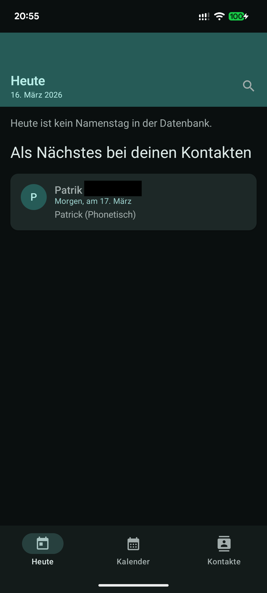
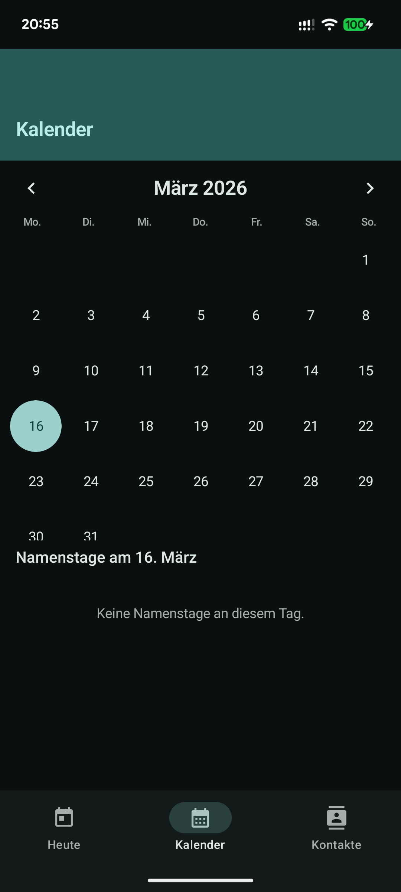
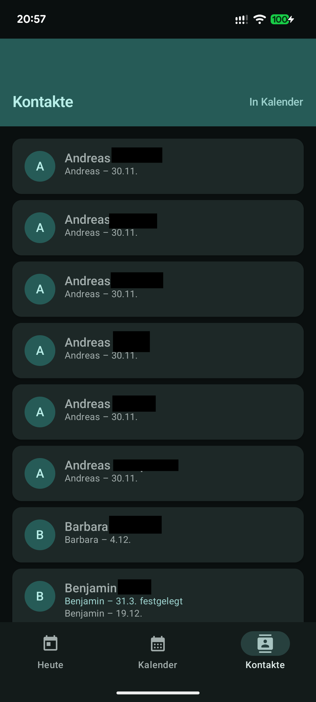
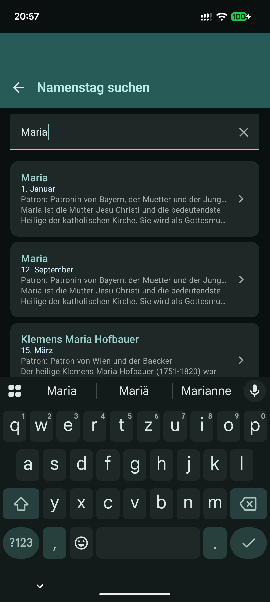

# Namenstag

[](LICENSE)
[](https://developer.android.com/)
[](https://kotlinlang.org/)

Namenstag is an Android app for looking up Catholic name days, matching them against local contacts, and sending optional daily reminders. The app works fully offline and keeps contact processing on-device.

## Highlights

- Today view with the current day's saints and name days
- Calendar view for browsing any day of the year
- Search for names and partial matches
- Contact matching with exact, alias, and Cologne phonetic matching
- Optional daily notifications around 07:00
- Around 200 saints and 55+ aliases stored locally
- No ads, no tracking, no runtime network dependency

## Screens

- `Today`: today's name days and saint details
- `Calendar`: browse name days by date
- `Contacts`: match device contacts to known names
- `Search`: find name days instantly while typing

<p align="center">
  
  
</p>
<p align="center">
  
  
</p>

## Tech Stack

- Kotlin 2.1
- Android Gradle Plugin 8.7
- Jetpack Compose + Material 3
- Hilt
- Room
- WorkManager
- Kotlin Serialization
- Coroutines

## Requirements

- JDK 17
- Android Studio with Android SDK 35
- Android 8.0+ device or emulator (`minSdk 26`)

## Quick Start

Clone the repository and build a debug APK:

```bash
git clone git@github.com:speze88/namenstag.git
cd namenstag
./gradlew assembleDebug
```

To run the app in Android Studio:

1. Open the project.
2. Let Gradle sync.
3. Start an emulator or connect a device.
4. Run the `app` configuration.

## Testing

Run unit tests:

```bash
./gradlew testDebugUnitTest
```

Run instrumentation tests on a connected device or emulator:

```bash
./gradlew connectedDebugAndroidTest
```

## Release Builds

Release signing is loaded from `keystore.properties` or environment variables.

1. Copy `keystore.properties.template` to `keystore.properties`.
2. Fill in the keystore path, alias, and passwords.
3. Build the release APK:

```bash
./gradlew assembleRelease
```

If no signing config is provided, the release build falls back to the debug signing config.

### GitHub Actions Release Workflow

The repository includes a workflow at [`.github/workflows/android-release.yml`](.github/workflows/android-release.yml) that runs on every pushed tag, creates a GitHub Release, builds the release APK, and uploads the APK to the release.

Optional GitHub Actions secrets for signed release builds:

- `SIGNING_KEYSTORE_BASE64`
- `SIGNING_STORE_PASSWORD`
- `SIGNING_KEY_ALIAS`
- `SIGNING_KEY_PASSWORD`

If these secrets are not configured, the workflow still builds a release APK using the existing debug-signing fallback.

## Permissions

- `READ_CONTACTS` for local contact-to-name-day matching
- `POST_NOTIFICATIONS` for optional reminders on Android 13+

Both permissions are optional. Without contact access, the Today, Calendar, and Search screens still work.

## Privacy

- Contact data is read locally on the device
- No contact data is uploaded or shared
- The app is designed to work offline

See [`privacy_policy.html`](privacy_policy.html) for the current privacy policy.

## Project Structure

```text
app/src/main/java/com/speze88/namenstag/
|- data/          # Room database, repositories, contacts, seed data
|- domain/        # Models, matching logic, use cases
|- di/            # Hilt modules
|- notification/  # Notification handling
|- ui/            # Compose screens, navigation, theme, components
|- worker/        # Daily WorkManager scheduling
```

## Distribution Metadata

- F-Droid metadata: [`metadata/com.speze88.namenstag.yml`](metadata/com.speze88.namenstag.yml)
- Fastlane metadata: [`fastlane/metadata/android/de-DE`](fastlane/metadata/android/de-DE)

## Documentation

- User manual: [`HANDBUCH.md`](HANDBUCH.md)
- Privacy policy: [`privacy_policy.html`](privacy_policy.html)

## Contributing

Issues and pull requests are welcome at:

- Repository: <https://github.com/speze88/namenstag>
- Issue tracker: <https://github.com/speze88/namenstag/issues>

## License

This project is licensed under GPL-3.0-only. See [`LICENSE`](LICENSE).
